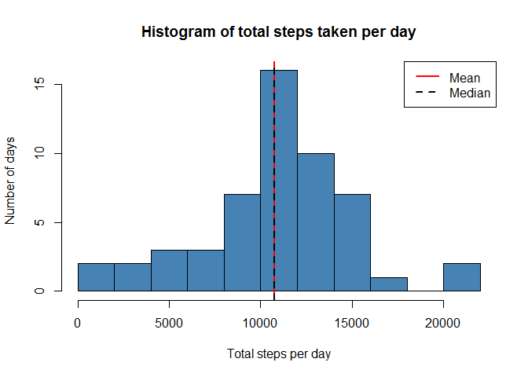
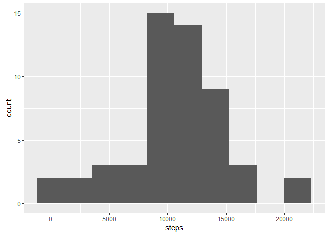
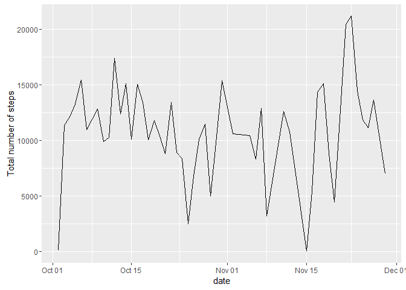
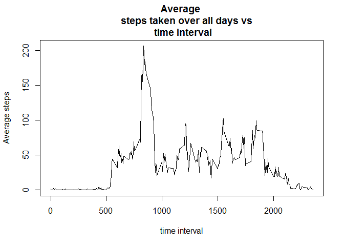
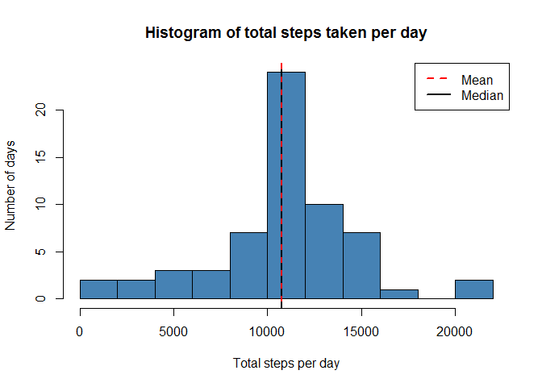
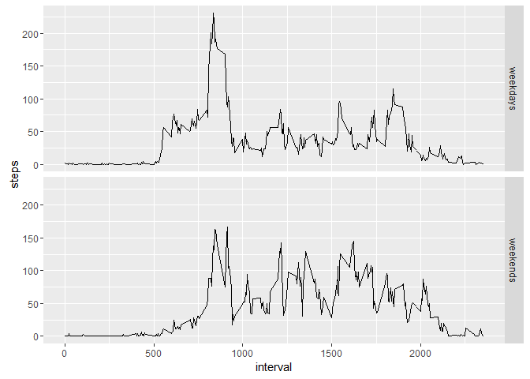

## Assignment Instructions
1.Code for reading in the dataset and/or processing the data
2.Histogram of the total number of steps taken each day
3.Mean and median number of steps taken each day
4.Time series plot of the average number of steps taken
5.The 5-minute interval that, on average, contains the maximum number of steps
6.Code to describe and show a strategy for imputing missing data
7.Histogram of the total number of steps taken each day after missing values are imputed
8.Panel plot comparing the average number of steps taken per 5-minute interval across weekdays and weekends
9.All of the R code needed to reproduce the results (numbers, plots, etc.) in the report

## Loading and preprocessing the data


```r
setwd("C:/Users/Martin Mancero/Desktop/Archivos R")
activity<-read.csv("activity.csv", sep = ",")
```
Exploring the basics of this data
The variable names and the structure of the file are given by

```r
names(activity)
```

```
## [1] "steps"    "date"     "interval"
```

```r
str(activity)
```

```
## 'data.frame':	17568 obs. of  3 variables:
##  $ steps   : int  NA NA NA NA NA NA NA NA NA NA ...
##  $ date    : Factor w/ 61 levels "2012-10-01","2012-10-02",..: 1 1 1 1 1 1 1 1 1 1 ...
##  $ interval: int  0 5 10 15 20 25 30 35 40 45 ...
```

```r
head(activity[which(!is.na(activity$steps)), ]) # data set with NA rows removed
```

```
##     steps       date interval
## 289     0 2012-10-02        0
## 290     0 2012-10-02        5
## 291     0 2012-10-02       10
## 292     0 2012-10-02       15
## 293     0 2012-10-02       20
## 294     0 2012-10-02       25
```
The format of the file is ready for analysis. No further processing is required.


2. Mean of "total number of step taken per day" over all days
-------------------------------------------------------------

Group the number of steps by date and intervals. Find the total number of steps per day over all days. Note that some of the days such as 2012-10-01 have no steps data. Remove such rows for this part.


```r
library(reshape2)
```

```
## Warning: package 'reshape2' was built under R version 3.3.3
```

```r
activity_melt <- melt(activity[which(!is.na(activity$steps)), ], id.vars = c("date", "interval"))
head(activity_melt)
```

```
##         date interval variable value
## 1 2012-10-02        0    steps     0
## 2 2012-10-02        5    steps     0
## 3 2012-10-02       10    steps     0
## 4 2012-10-02       15    steps     0
## 5 2012-10-02       20    steps     0
## 6 2012-10-02       25    steps     0
```

```r
steps_sum <- dcast(activity_melt, date ~ variable, sum)
head(steps_sum)
```

```
##         date steps
## 1 2012-10-02   126
## 2 2012-10-03 11352
## 3 2012-10-04 12116
## 4 2012-10-05 13294
## 5 2012-10-06 15420
## 6 2012-10-07 11015
```

Then we can find the mean of 'total number of steps per day'.

```r
summary(steps_sum$steps)
```

```
##    Min. 1st Qu.  Median    Mean 3rd Qu.    Max. 
##      41    8841   10760   10770   13290   21190
```

Histogram of the total number of steps taken each day.

```r
hist(steps_sum$steps, main = "Histogram of total steps taken per day",
     xlab = "Total steps per day", ylab = "Number of days", 
     breaks = 10, col = "steel blue")
abline(v = mean(steps_sum$steps), lty = 1, lwd = 2, col = "red")
abline(v = median(steps_sum$steps), lty = 2, lwd = 2, col = "black")
legend(x = "topright", c("Mean", "Median"), col = c("red", "black"),       lty = c(1, 2), lwd = c(2, 2))
```

<!-- -->

Equivalent ggplot.

```r
library(ggplot2)
ggplot(steps_sum, aes(steps)) + geom_histogram(bins = 10)
```

<!-- -->

Here's a plot showing the trend in total number of steps taken per day over two months.

```r
library(lubridate)
```

```
## Warning: package 'lubridate' was built under R version 3.3.3
```

```
## 
## Attaching package: 'lubridate'
```

```
## The following object is masked from 'package:base':
## 
##     date
```

```r
steps_sum$date <- as.Date(steps_sum$date)
ggplot(steps_sum, aes(date, steps)) + geom_line() +            
        scale_x_date(date_labels = "%b %d") + 
        ylab("Total number of steps")
```

<!-- -->

3. Average daily activity pattern
---------------------------------

In this section, we make a time series plot (i.e. type = "l") of the 5-minute interval (x-axis) and the average number of steps taken averaged across all days.


```r
stepsmeaninterval <- dcast(activity_melt, interval ~ variable, mean, na.rm = TRUE)
head(stepsmeaninterval)
```

```
##   interval     steps
## 1        0 1.7169811
## 2        5 0.3396226
## 3       10 0.1320755
## 4       15 0.1509434
## 5       20 0.0754717
## 6       25 2.0943396
```

```r
plot(stepsmeaninterval$interval, stepsmeaninterval$steps, ty = "l", 
     xlab = "time interval", ylab = "Average steps", main = "Average 
     steps taken over all days vs \n time interval")
```

<!-- -->

The time interval during which the maximum number of steps is taken is


```r
maxsteps_interval <- stepsmeaninterval$interval[which.max(stepsmeaninterval$steps)]
maxsteps_interval
```

```
## [1] 835
```

4. Imputing missing values
--------------------------

First of all, let us get a sense for the missing values. Are there days with all time intervals reporting NA step values? 

We can replace the missing data for a day by the time average over all other days. 

```r
## Impute missing values
activity2 <- split(activity, activity$interval)
activity2 <- lapply(activity2, function(x) {
        x$steps[which(is.na(x$steps))] <- mean(x$steps, na.rm = TRUE)
        return(x)
})
activity2 <- do.call("rbind", activity2)
row.names(activity2) <- NULL
activity2 <- split(activity2, activity2$date)
df <- lapply(activity2, function(x) {
        x$steps[which(is.na(x$steps))] <- mean(x$steps, na.rm = TRUE)
        return(x)
})
activity2 <- do.call("rbind", activity2)
row.names(activity2) <- NULL
head(activity2)
```

```
##       steps       date interval
## 1 1.7169811 2012-10-01        0
## 2 0.3396226 2012-10-01        5
## 3 0.1320755 2012-10-01       10
## 4 0.1509434 2012-10-01       15
## 5 0.0754717 2012-10-01       20
## 6 2.0943396 2012-10-01       25
```
Assuming that the time intervals form a disjoint partitioning of 24 hrs, i.e. 1 day is found to be erroneous. The time interval for each day corresponds to approximately 40 hours, which refutes the intervals being disjoint.


```r
library(reshape2)
activity_melt2 <- melt(activity2, id.vars = c("date", "interval"))
steps_sum <- dcast(activity_melt2, date ~ variable, sum, na.rm = TRUE)
head(steps_sum)
```

```
##         date    steps
## 1 2012-10-01 10766.19
## 2 2012-10-02   126.00
## 3 2012-10-03 11352.00
## 4 2012-10-04 12116.00
## 5 2012-10-05 13294.00
## 6 2012-10-06 15420.00
```
Histogram of the total number of steps taken each day with the imputed missing values.

```r
hist(steps_sum$steps, main = "Histogram of total steps taken per day", 
     xlab = "Total steps per day", ylab = "Number of days", 
     breaks = 10, col = "steel blue")
abline(v = mean(steps_sum$steps), lty = 1, lwd = 2, col = "red")
abline(v = median(steps_sum$steps), lty = 2, lwd = 2, col = "black")
legend(x = "topright", c("Mean", "Median"), col = c("red", "black"), lty = c(2, 1), lwd = c(2, 2))
```

<!-- -->

Number of rows with NA values

```r
sum(is.na(activity$steps))
```

```
## [1] 2304
```

```r
sum(is.na(activity$steps))*100/nrow(activity) # Percentage of rows with missing values
```

```
## [1] 13.11475
```

5. Differences in activity patterns: Weekdays vs Weekends
---------------------------------------------------------

Create a new column describing if the date is a weekday or weekend.


```r
library(lubridate)
weekends <- which(weekdays(as.Date(activity2$date)) == "Saturday" |
              weekdays(as.Date(activity2$date)) == "Sunday")
weekdays <- which(weekdays(as.Date(activity2$date)) != "Saturday" &
              weekdays(as.Date(activity2$date)) != "Sunday")
temp <- c(rep("a", length(activity2)))
temp[weekends] <- "weekend"
temp[weekdays] <- "weekday"
length(temp)
```

```
## [1] 17568
```

```r
names(temp) <- "day"
activity2 <- cbind(activity2, temp)
names(activity2)[4] <- "day"
```

Steps taken over each interval averaged across weekday days and weekend days.


```r
activity2split <- split(activity2, activity2$day)
stepsmean_interval <- lapply(activity2split, function(x) {
        temp <- aggregate(x$steps, list(x$interval), mean)
        names(temp) <- c("interval", "steps")
        return(temp)
})
## Unsplit stepsmean_interval
stepsmean_interval <- do.call("rbind", stepsmean_interval)
weekdays <- grep("weekday" ,row.names(stepsmean_interval))
weekends <- grep("weekend" ,row.names(stepsmean_interval))
temp <- c(rep("a", length(stepsmean_interval$steps)))
temp[weekdays] <- "weekdays"
temp[weekends] <- "weekends"
stepsmean_interval <- cbind(stepsmean_interval, temp)
row.names(stepsmean_interval) <- NULL
names(stepsmean_interval)[3] <- "day"
head(stepsmean_interval)
```

```
##   interval      steps      day
## 1        0 2.25115304 weekdays
## 2        5 0.44528302 weekdays
## 3       10 0.17316562 weekdays
## 4       15 0.19790356 weekdays
## 5       20 0.09895178 weekdays
## 6       25 1.59035639 weekdays
```

```r
tail(stepsmean_interval)
```

```
##     interval       steps      day
## 571     2330  1.38797170 weekends
## 572     2335 11.58726415 weekends
## 573     2340  6.28773585 weekends
## 574     2345  1.70518868 weekends
## 575     2350  0.02830189 weekends
## 576     2355  0.13443396 weekends
```

```r
library(ggplot2)
ggplot(stepsmean_interval, aes(interval, steps)) + geom_line() + facet_grid(day ~ .) 
```

<!-- -->

The mean number of steps taken over the weekdays and weekends.


```r
stepsdatamelt <- melt(stepsmean_interval, id.vars = c("interval",
                                                      "day"))
dcast(stepsdatamelt, day ~ variable, mean) # Average steps
```

```
##        day    steps
## 1 weekdays 35.61058
## 2 weekends 42.36640
```
